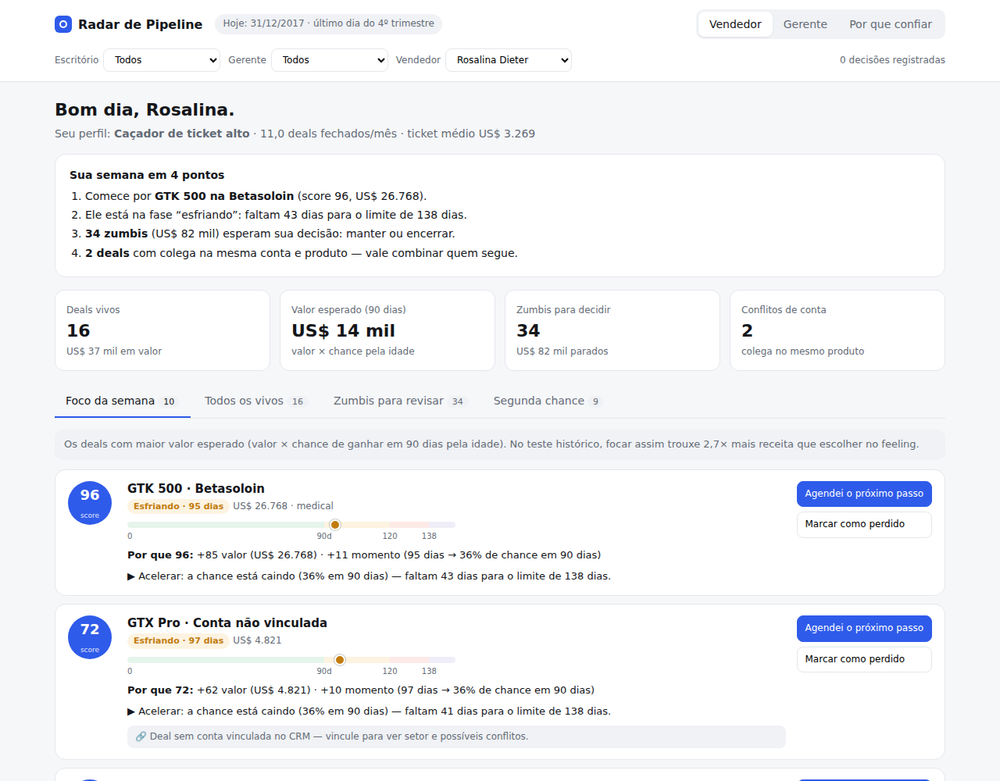
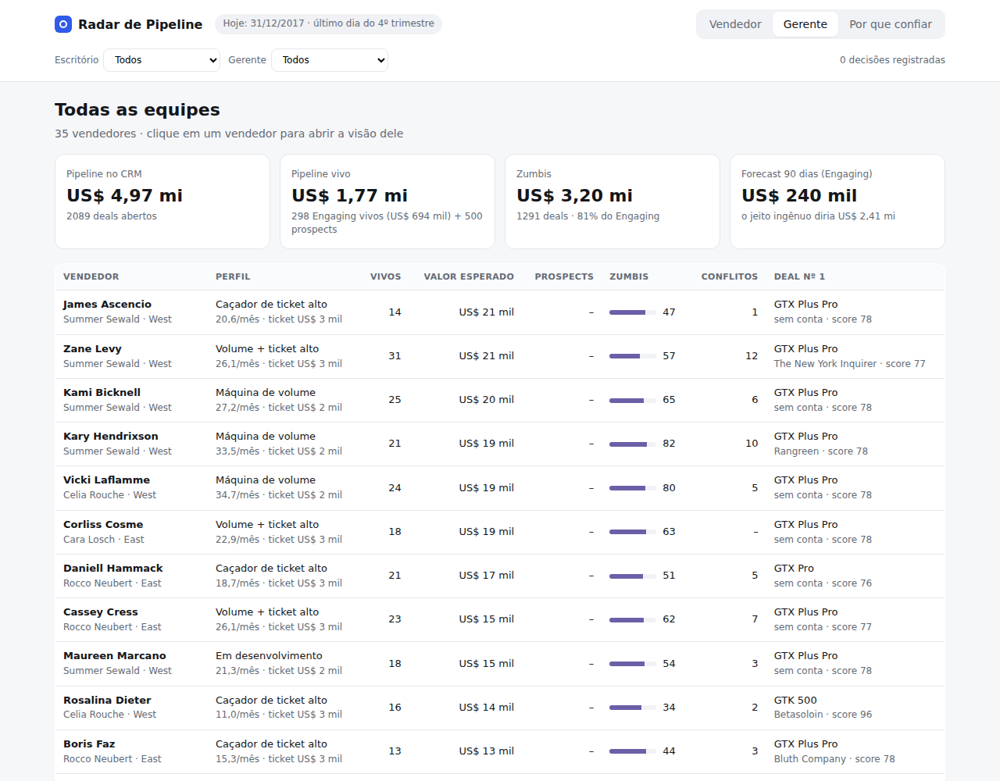
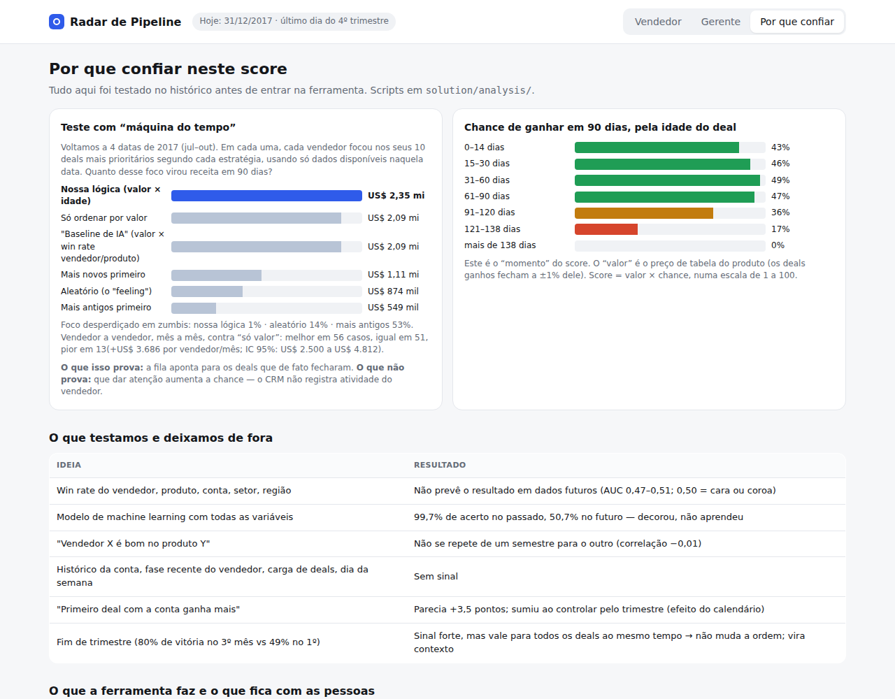

# Submissão — Matheus Garmatz — Challenge 003 (Lead Scorer)

## Sobre mim

- **Nome:** Matheus Garmatz
- **LinkedIn:** [linkedin.com/in/matheus-garmatz](https://www.linkedin.com/in/matheus-garmatz/)
- **Challenge escolhido:** 003 — Lead Scorer (Vendas / RevOps)
- **App no ar:** **[radar-de-pipeline.vercel.app](https://radar-de-pipeline.vercel.app)** · **Vídeo (3 min):** **[youtu.be/LVztPy_NK4Q](https://youtu.be/LVztPy_NK4Q)**

---

## Executive Summary

O deal mais valioso ainda vivo da empresa — um GTK 500 de **US$ 26.768** na Betasoloin — está a **43 dias** de passar do ponto em que nenhum deal jamais fechou, e hoje nada no CRM avisa isso. Construí o **Radar de Pipeline**: uma ferramenta que o vendedor abre na segunda-feira e vê seus 10 deals prioritários, com um score que se explica em português ("96 = +85 pelo valor, +11 pelo momento") e o próximo passo de cada um. Antes de construir, testei as variáveis "óbvias" (win rate do vendedor, produto, conta, setor): **nenhuma prevê o resultado** em dados futuros — um score feito com elas é ruído com cara de ciência. O que prevê é **valor do deal × tempo no pipeline**: **81%** dos deals em Engaging (US$ 3,2 mi) já passaram de 138 dias, idade em que **0 de 264** ganharam. No teste com "máquina do tempo", a fila proposta concentrou **US$ 2,35 mi** de receita no foco dos vendedores, contra **US$ 0,87 mi** escolhendo aleatoriamente e **US$ 2,09 mi** ordenando só por valor.

---

## Solução

| Vendedor | Gerente | Por que confiar |
|---|---|---|
|  |  |  |

**Vendedor** — resumo da semana em 3–4 frases; fila "Foco da semana"; cada deal mostra score decomposto, relógio (saudável → esfriando → última chance → zumbi), próximo passo e alerta quando outro vendedor está na mesma conta + produto. Abas para zumbis, segunda chance e prospects.
**Gerente** — pipeline do CRM × pipeline vivo, zumbis e conflitos por vendedor, perfil de cada um, forecast ingênuo × ajustado. Filtros por escritório e gerente.
**Por que confiar** — o backtest, a curva de chance por idade, o que foi testado e descartado, e o que a ferramenta não decide sozinha.

### Abordagem

1. **Entender antes de construir.** Liguei as 4 tabelas, achei 4 problemas de qualidade (produto "GTXPro" em 1.480 linhas, 1.425 deals abertos sem conta, 500 prospects sem data, perdas anteriores a mar/2017 ausentes) e testei cada variável fora da amostra.
2. **Desconfiar dos próprios achados.** Dois "insights" eram efeito do calendário e morreram quando controlei pelo trimestre (detalhes no [process log](process-log/README.md)).
3. **Provar antes de entregar.** Backtest em 4 datas de 2017, sem vazamento de informação futura.
4. **Construir com a lógica testada.** O score do app é testado contra os números da análise (12 testes com os dados reais).

### Resultados / Findings

| Achado | Número | Fonte |
|---|---|---|
| Variáveis óbvias não preveem quem ganha | win rate 60–65% em todo recorte; AUC 0,48–0,51 fora da amostra; ML com tudo: 99,7% no passado, 50,7% no futuro | `01`, `02` |
| O pipeline está inflado | 1.291 de 1.589 deals em Engaging (81%) passaram de 138 dias = US$ 3,2 mi dos US$ 5,0 mi abertos | `01` |
| O limite de 138 dias é real | coortes com 213–305 dias de janela fecharam todas em ≤ 136 dias; o resto travou | `01` |
| Fim de trimestre importa — para todos | 80% de vitória no 3º mês × 49% no 1º, em 30 de 30 vendedores | `02` |
| Receita depende de volume e mix, não de conversão | volume explica 46%, ticket 28%, conversão 1% | `03` |
| Ninguém é "especialista" num produto | desempenho vendedor×produto não se repete entre semestres (r = −0,01) | `03` |
| Contas sem dono | ~15 vendedores por conta; 49% dos pares conta+produto abertos têm 2+ vendedores; em 5.149 pares os dois ganharam | `03` |
| Perder não queima a conta | oportunidades reabertas após perda ganham 61,7% (média: 61,5%) | `03` |

### Lógica do score (e por quê)

**Score = valor esperado em 90 dias = preço do produto × chance de ganhar pela idade do deal**, numa escala 1–100.

- **Valor:** preço de tabela. É confiável (os ganhos fecham a ±1% dele) e varia 500× (US$ 55 a US$ 26.768).
- **Chance pela idade:** aprendida no histórico — 43–49% até 90 dias, 36% até 120, 17% até 138, **0% acima** (0 de 264).
- **Escala logarítmica**, para o score se dividir exatamente em *pontos de valor + pontos de momento* — é o que o vendedor lê no card.
- **Ficaram de fora de propósito:** win rate de vendedor, produto, conta e setor — testados, sem sinal. O efeito de fim de trimestre também não entra no score: vale para todos os deals ao mesmo tempo, então não muda a ordem.

Código: [`solution/app/src/scoring/`](solution/app/src/scoring/) · parâmetros com a fonte de cada número em [`config.ts`](solution/app/src/scoring/config.ts).

### Setup

```bash
cd submissions/matheus-garmatz/solution/app
npm install
npm run dev      # http://localhost:5173
npm test         # 12 testes com os dados reais
npm run build    # produção
npx vercel deploy --prod   # deploy (Vercel detecta Vite sozinha)
```

Análise (Python 3.10+): `cd solution/analysis && pip install -r requirements.txt && ./run_all.sh`

### Recomendações (em ordem)

1. **Esta semana — limpar os zumbis.** Cada vendedor decide os seus (manter com motivo ou encerrar). Libera foco e torna o forecast honesto: o ingênuo errou de +83% a +190% no backtest; o ajustado, +38% a +60%.
2. **Este mês — regra de atribuição de contas.** Carteira por família de empresas (o campo *empresa-mãe* já existe), balanceada por **capacidade** (volume, que é estável: r = 0,95), não por "talento" (que não se repete). Antes, investigar os 5.149 pares em que dois vendedores ganharam o mesmo produto na mesma conta: venda duplicada ou contas com várias áreas compradoras?
3. **Este trimestre — registrar atividade no CRM.** Hoje o CRM não sabe se alguém ligou para o cliente; por isso a ferramenta não pode afirmar que um zumbi está morto nem medir se dar atenção muda o resultado. Os botões de decisão do app são o começo desse dado.
4. **Perguntar ao escritório Central** por que ele é o único com Prospecting e por que todos os seus Engaging abertos são de jul–ago/2017 (importação em massa? outro processo?).

### Limitações

- **O backtest prova que a fila aponta para os deals que fecharam — não que dar atenção os faz fechar.** Sem dado de atividade, causalidade não é mensurável.
- O dataset parece sintético (taxas quase idênticas em todo recorte). A ferramenta foi feita para isso não importar: as variáveis que hoje ficam de fora foram *testadas*; com dados reais, o mesmo teste diria quais ligar.
- Prospecting (500 deals) não tem data: fica numa fila ordenada só por valor e fora do backtest.
- O forecast ajustado ainda superestima (+38% a +60%). Referência, não meta.
- Decisões ficam salvas no navegador; em produção iriam para o CRM. "Hoje" é fixo em 31/12/2017 (último dia do dataset).

---

## Process Log — Como usei IA

> Narrativa completa, com cada iteração, erro e correção: **[process-log/README.md](process-log/README.md)**

### Ferramentas usadas

| Ferramenta | Para que usei |
|---|---|
| Claude (Cowork) | Exploração dos dados, testes estatísticos, backtest, protótipo HTML, app React, documentação |
| Python (pandas, scipy, scikit-learn) | Análise e backtest reproduzíveis (`solution/analysis/`) |
| React + TypeScript + Vite + Vitest | App e testes da lógica do score |
| Playwright | Testar a interface e gerar os screenshots |
| Vercel / GitHub | Deploy e entrega |

### Workflow

1. Li os 4 desafios e escolhi o 003 pelo meu perfil (construo produto) e pela relevância para uma empresa de vendas.
2. Exploração dos dados **antes** de pensar em interface → descoberta de que as variáveis óbvias não têm sinal.
3. Pedi para a IA explicar "como para uma criança" e decidi a lógica (valor × tempo) só depois de entender.
4. Rodei a análise de novo pedindo "fora da caixa, sem alucinar" → a IA corrigiu o próprio erro (efeito das "2 primeiras semanas" era calendário).
5. Pedi a planilha relacional por escritório › gerente › vendedor → apareceram o padrão do Central e as contas sem dono.
6. Fiz perguntas de negócio (especialização, carteira, escritórios disputando, ressuscitados, previsibilidade) → cada uma virou um teste.
7. Exigi prova com números reais → backtest com "máquina do tempo".
8. Questionei "o que não automatizar" e se valia trocar de desafio → desenho com humano na decisão; mantive o 003.
9. Protótipo HTML para validar a UX → ajuste para vendedores com pipeline fraco.
10. Construção com testes cruzados entre app e análise → pegaram um bug na análise.

### Onde a IA errou e como corrigi

| Erro | Como apareceu | Correção |
|---|---|---|
| "Deal que passa de 2 semanas ganha mais" | Pedi para reanalisar fora da caixa | Era o calendário: dentro de cada mês do trimestre a diferença some |
| "Primeiro deal com a conta ganha mais" | Pedi uma segunda rodada | De novo o calendário: no mesmo trimestre, 61,7% × 61,0% |
| Coorte de 2016 com 82% de vitória | Checagem de datas | Perdas antes de mar/2017 não existem; coorte excluída |
| Segunda chance: 1.702 oportunidades | Teste cruzado app × Python | Bug de pandas (`row.product` é método); correto: 489 |
| Pares simultâneos: 18.875 | Reescrita dos scripts | Prospects sem data contavam como abertos; correto: 16.694 |

### O que eu adicionei que a IA sozinha não faria

- **As perguntas de negócio** que geraram os melhores achados: carteira de clientes, escritórios disputando conta, negócios ressuscitados, "o que cada um faz bem".
- **A exigência de prova** ("me prova com números reais") que levou ao backtest — sem ela a entrega seria uma opinião bem formatada.
- **A pressão por simplicidade** ("explica como para uma criança"), que virou a linguagem da ferramenta: relógio, zumbi, próximo passo.
- **O critério de não automatizar decisões** que dependem de contexto humano — e a validação de que o desenho atende o case antes de construir.

---

## Evidências

- [x] Git history (commits por etapa nesta branch)
- [x] Narrativa do processo: [process-log/README.md](process-log/README.md)
- [x] Protótipo intermediário: [process-log/prototipo-v0.html](process-log/prototipo-v0.html)
- [x] Scripts e saídas da análise: [solution/analysis/](solution/analysis/)
- [x] Chat export — trechos da conversa com a IA, com minhas mensagens literais: [process-log/chat-exports/trechos-da-conversa.md](process-log/chat-exports/trechos-da-conversa.md)
- [x] Vídeo (3 min) — a ferramenta e o raciocínio: [youtu.be/LVztPy_NK4Q](https://youtu.be/LVztPy_NK4Q)

---

_Submissão enviada em: [data]_
